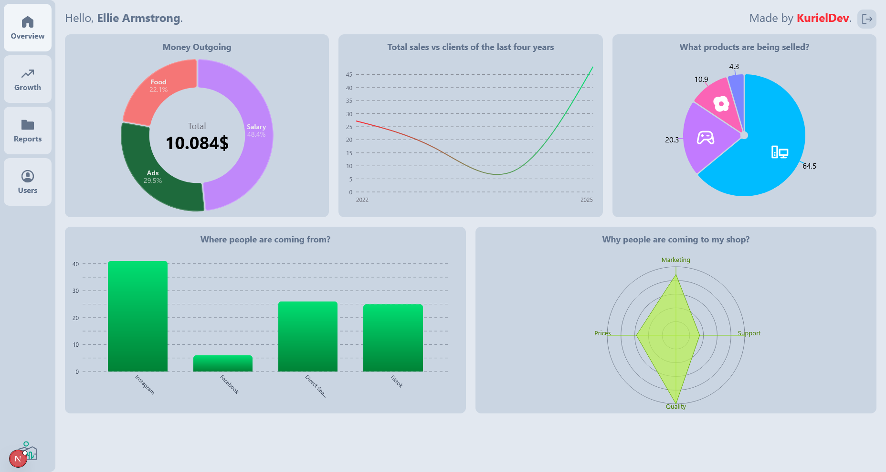
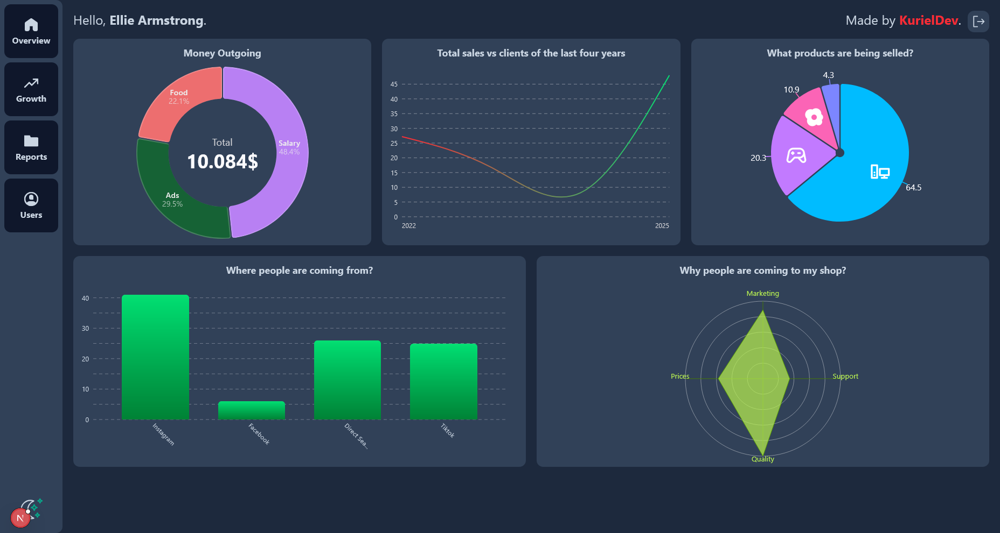

<div align="center">
  Finance Stats
  <br />
  <a href="#about"><strong>Explore the screenshots »</strong></a>
  <br />
</div>

<div align="center">
<br />

[](LICENSE)

[](https://github.com/Kuriel23)

</div>

<details open="open">
<summary>Table of Contents</summary>

- [About](#about)
  - [Built With](#built-with)
- [Getting Started](#getting-started)
  - [Installation](#installation)
- [Usage](#usage)
- [Project assistance](#project-assistance)
- [Contributing](#contributing)
- [License](#license)

</details>

---

## About

Finance Stats is a simple NextJS with Dark/Light theme, drag-and-drop and charts. It's my first project using charts and drag-and-drop, I used him to learn more about these tecnology and for adding such useful website to my portfolio.

<details>
<summary>Screenshots</summary>
<br>

|                               Home Page                               |                               Home Page (Dark)                         |
| :-------------------------------------------------------------------: | :--------------------------------------------------------------------: |
|           |              |

</details>

### Built With

> NextJS
> Swapy
> rosencharts
> TailwindCSS

## Getting Started

### Installation

```bash
npm install
# or
yarn install
# or
pnpm install
# or
bun install
```

## Usage

First, run the development server:

```bash
npm run dev
# or
yarn dev
# or
pnpm dev
# or
bun dev
```

Open [http://localhost:3000](http://localhost:3000) with your browser to see the result.

## Project assistance

If you want to say **thank you**:

- Add a [GitHub Star](https://github.com/Kuriel23/finance-stats) to the project.

## License

This project is licensed under the **MIT license**.

See [LICENSE](LICENSE) for more information.